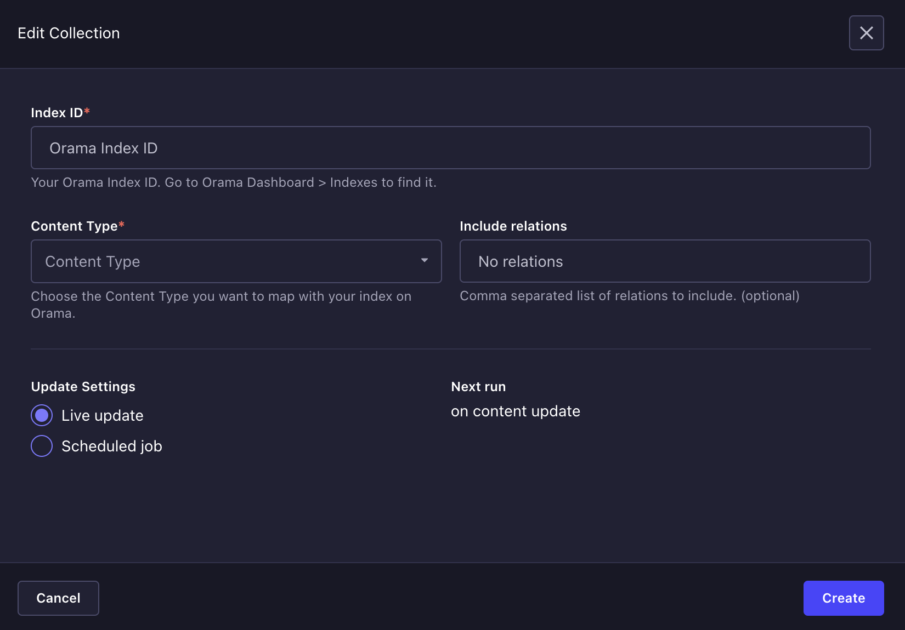
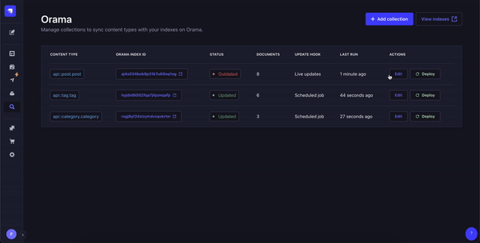

# Orama - Strapi Plugin

## Introduction
The Orama Strapi plugin integrates Orama Cloud's search and answers engine into your Strapi application, providing seamless search capabilities.

## Installation (via yarn)

1. Go to your existing project or create a new Strapi project with:
    ```sh
    yarn create strapi-app my-strapi-project --quickstart
    ```
2. Create a folder `src/plugins` if it doesn't already exist.
3. Install the Orama Strapi plugin:
    ```sh
    yarn add @oramacloud/strapi-plugin
    ```

## Installation (via Strapi Marketplace)

1. Go to your existing project or create a new Strapi project with:
    ```sh
    yarn create strapi-app my-strapi-project --quickstart
    ```
2. Go to your Strapi administration dashboard.
3. Navigate to the `Marketplace` section.
4. Search for `Orama Cloud` and install the plugin.

## Configuration

Configure the plugin in the `config/plugins.js` file:
```js
// config/plugins.js

module.exports = ({ env }) => ({
  orama: {
    config: {
      privateApiKey: env('ORAMA_PRIVATE_API_KEY'),
    },
  },
});
```

You can configure your `ORAMA_PRIVATE_API_KEY` in [Developer tools](https://cloud.orama.com/developer-tools) page on Orama Cloud.

## Usage

Configure and manage `Collections` that map your Strapi app Content-Types with an Index on [Orama Cloud](https://cloud.orama.com/indexes).

### Creating an index

- Visit Orama Cloud and [Create](https://cloud.orama.com/indexes/create/from-integrations) a new "REST API" index.
- Define the searchable properties in the schema. This schema reflects your Strapi's model fields that should be searchable.
- Once your index is ready, copy the `indexId` and visit your Strapi administration dashboard.

### Managing collections

Collections map your Content-Types on Strapi with an index on Orama Cloud. To keep your index in sync with the data, you can configure the update settings for each collection.

- Select `Orama Cloud` from the menu to manage your collections.
- Add a new collection.



- Paste your newly created `indexId`.
- Select a Content Type.
- (Optional) Specify the related records to include.
- Select the Update Settings option:
  - **Live updates** will update your index as soon as any content is created, updated or deleted.
  - **Scheduled job** will automatically update your index at a defined frequency: every 30 minutes, hourly, daily, weekly or monthly.

When an index is not in sync with the latest changes in Strapi, the collection status is set to `outdated`. 
When the **Scheduled job** is executed, it checks the collection status, to avoid triggering an update if the data is already in sync. You can always trigger a new deployment manually.


